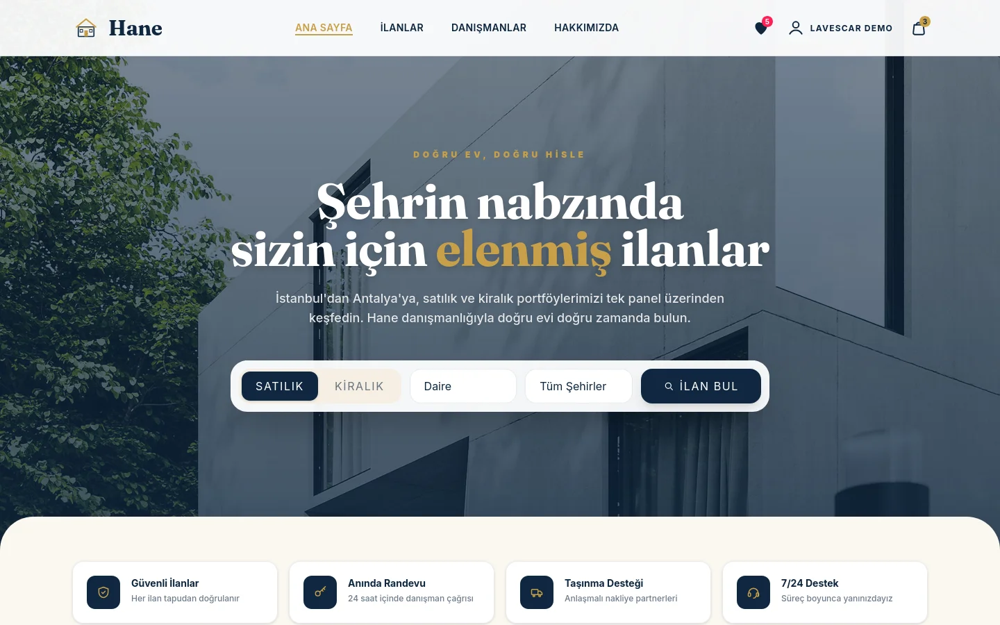
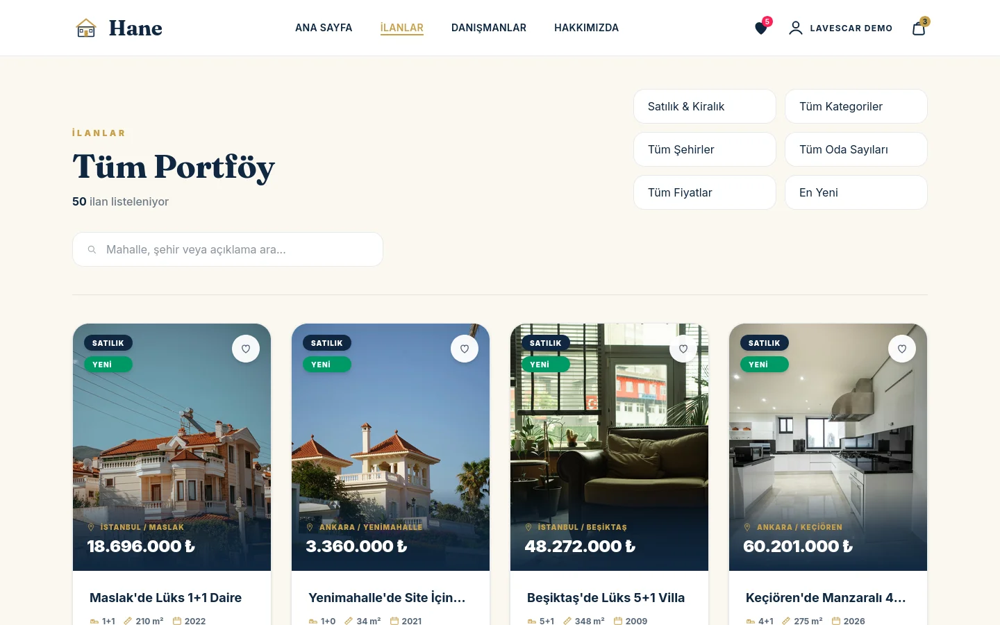
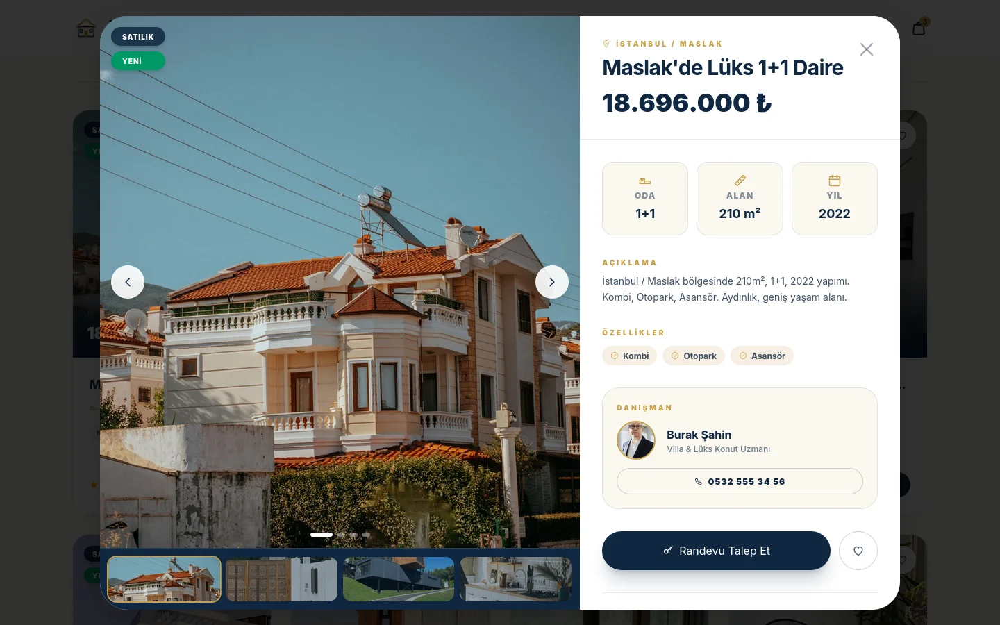
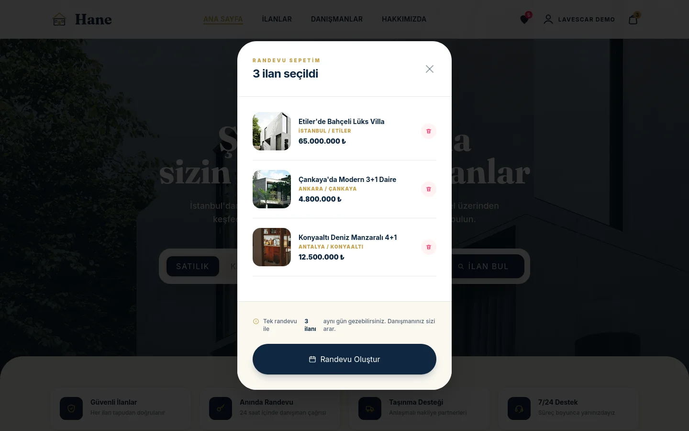
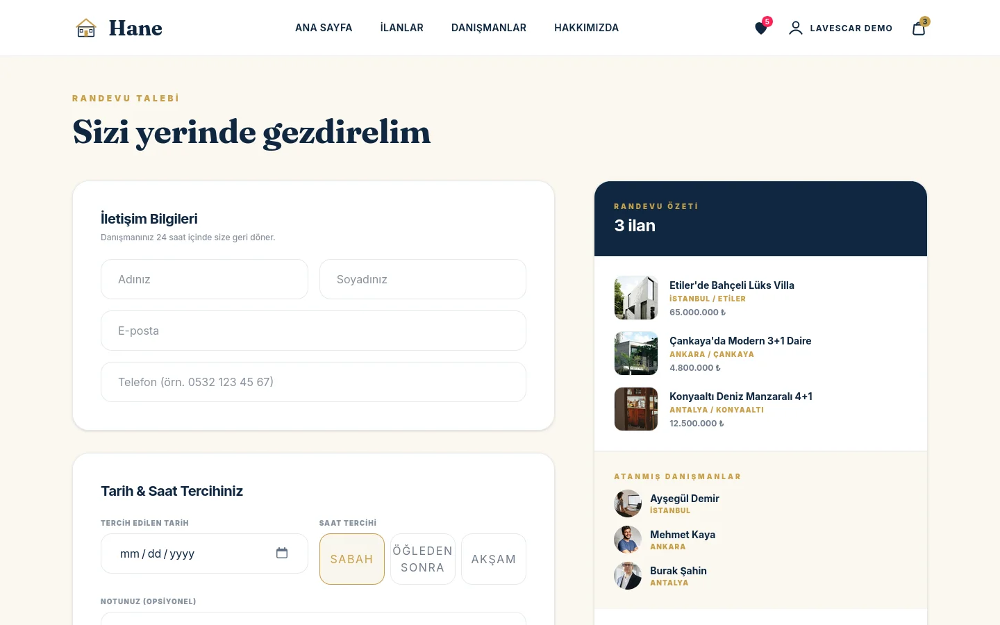
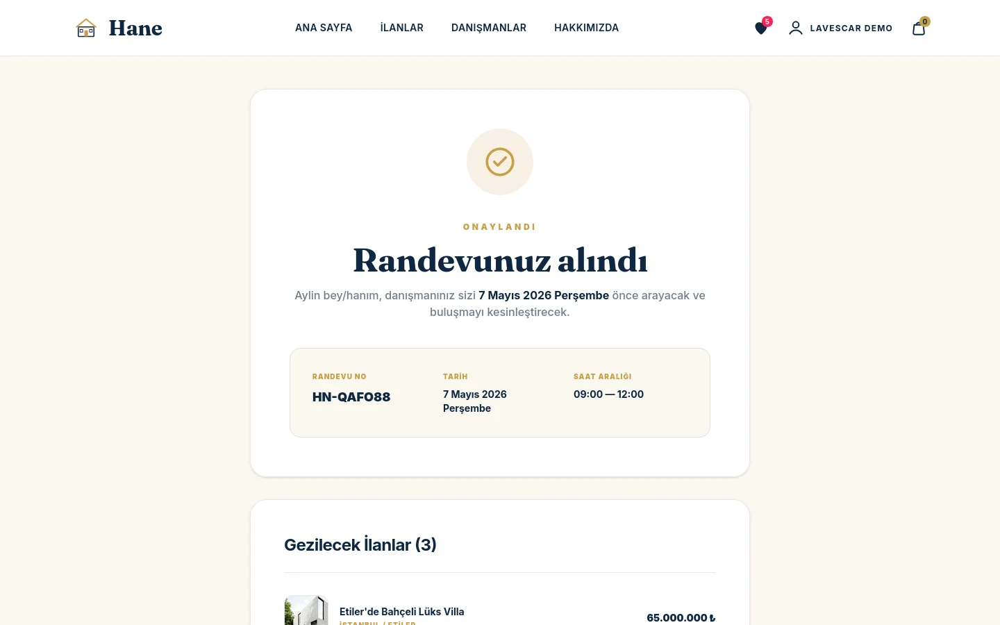
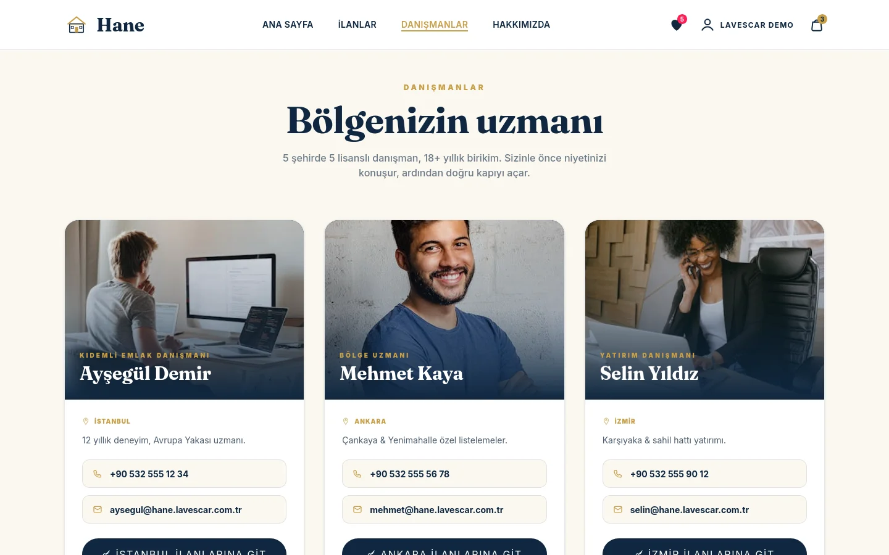
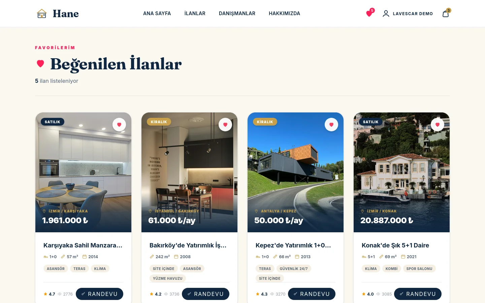

<div align="center">


# Hane Realty

**Türkiye 5-şehir lisanslı emlak danışmanlığı demo storefront'u** — listeler, filtre, ilan detayı, danışman eşleşmesi, randevu sepeti ve onay akışı tek tutarlı SPA içinde.

[](#tech-stack)
[](https://hane.lavescar.com.tr)
[](#license)

[**▸ Live demo**](https://hane.lavescar.com.tr) · [**▸ Portfolyo**](https://lavescar.com.tr) · [**▸ Diğer demolar**](https://lavescar.com.tr/#projects)

</div>

---

<p align="center"></p>

## Genel bakış

Hane, küçük emlak ofislerinin müvekkille buluşma akışını hızlandırmak için tasarlandı: ilan tarama → danışman eşleşmesi → randevu sepeti → onay. Tüm veri client-side mock; gerçek bir CRM/MLS arka ucuna bağlanmaya hazırdır. 5 büyükşehir kapsamında lisans/danışman havuzu modeli demo amaçlı tutulur.

## Özellikler

- **Çok-şehirli ilan kataloğu** — İstanbul, Ankara, İzmir, Antalya, Bursa
- **Akıllı filtre** — fiyat aralığı, oda sayısı, m², semt, listeleme yaşı
- **İlan detayı** — galeri, oda planı, semt rehberi, danışman kartı
- **Danışman eşleşmesi** — uzman alan + dil + müsaitlik filtresi
- **Randevu sepeti** — birden fazla ilan için tek slot, çift sayım önleme
- **Onay akışı** — özet + iletişim formu + email/SMS placeholder
- **İstek listesi (Wishlist)** — kalıcı favori ilanlar
- **localStorage persistence** — sepet ve favoriler tarayıcıda saklanır

## Tech stack

| Layer | Technology |
|---|---|
| Framework | Svelte 5 (rune-based reactivity) |
| Build | Vite 7 |
| Styling | Tailwind CSS 4 (`@tailwindcss/vite` plugin) |
| State | Module-scoped `$state()` stores + `localStorage` |
| Images | Unsplash + lokal proxy fallback |
| Deploy | Cloudflare Pages |

## Ekran görüntüleri

<table>
  <tr>
    <td></td>
    <td></td>
  </tr>
  <tr>
    <td></td>
    <td></td>
  </tr>
  <tr>
    <td></td>
    <td></td>
  </tr>
  <tr>
    <td colspan="2"></td>
  </tr>
</table>

## Hızlı başlangıç

```bash
git clone https://github.com/Lavescar-dev/hane-realty.git
cd hane-realty

npm install
npm run dev          # → http://localhost:5173
```

Build:

```bash
npm run build        # → dist/
npm run preview      # built bundle önizleme
```

## Backend ekleme

Mevcut sürüm tamamen browser-only çalışır. Gerçek bir emlak ofisine bağlamak için:

- **MLS feed** — XML/JSON sync (her gece), normalize → SQLite/Postgres
- **Danışman CRM** — randevu kaydı, müşteri timeline (örn. Rust/Axum)
- **İletişim** — SMS/email gönderimi (NetGSM, AWS SES)
- **Auth** — danışman portalı için Argon2 + session

`src/stores/` katmanı API istemcisini swap'lemek için izole edilmiş.

## Deploy

Cloudflare Pages için doğrudan repo bağlanır:

| Field | Value |
|---|---|
| Build command | `npm install && npm run build` |
| Build output directory | `dist` |
| Node version | `20` |

## License

MIT © 2026 Lavescar

> İlan görselleri Unsplash'tan demo amaçlı yüklenir.

---

<sub>Built by **[Lavescar](https://lavescar.com.tr)** · [Portfolyo](https://lavescar.com.tr/#projects) · [efe@lavescar.com.tr](mailto:efe@lavescar.com.tr)</sub>
